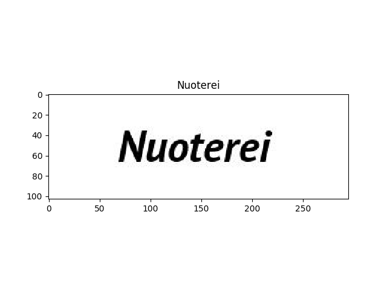

# Text Recognition in Images

All the software included in this repository was developed during the 1st edition (2019) of the COmputer Science Hackathon organized by the University of Udine.

# License

This software is licensed under the Creative Commons Attribution-NonCommercial-ShareAlike 4.0 License.

